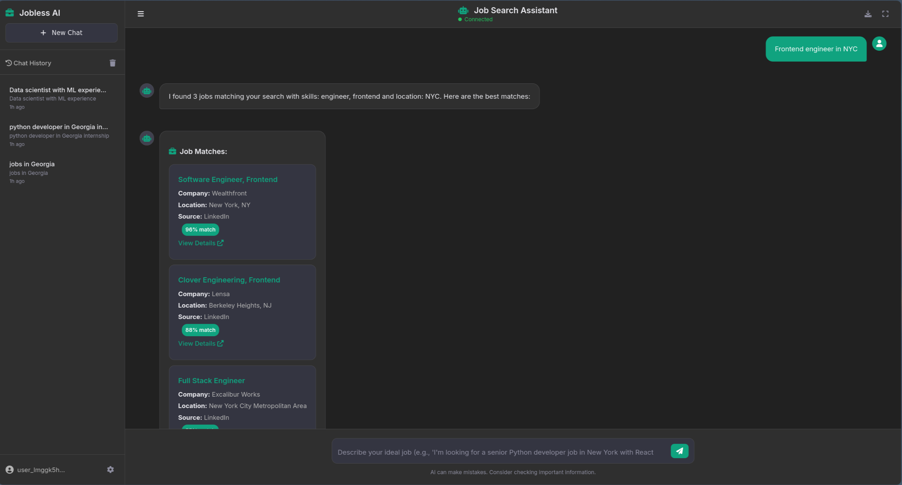
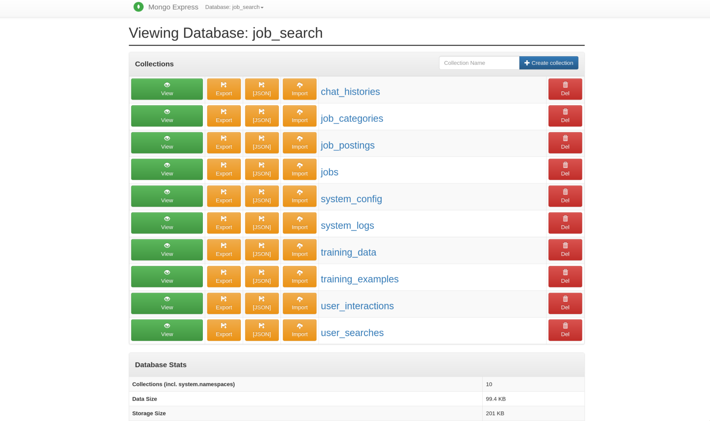

# 🔍 MCP Job Search System

An intelligent job search system using MCP (Model Context Protocol) with AI-powered job matching, supporting both English and Georgian languages. Features MongoDB data storage, PyTorch model training with LoRA fine-tuning, and comprehensive Docker infrastructure.

## ✨ Features

- **🤖 AI-Powered Job Matching**: Advanced natural language understanding for job requirements
- **🌍 Multi-Language Support**: English and Georgian language support with specialized scrapers
- **🗄️ MongoDB Backend**: Scalable data storage with comprehensive indexing
- **🔥 PyTorch Training**: LoRA fine-tuning with automatic GPU optimization
- **🐳 Docker Infrastructure**: Complete containerized setup with monitoring
- **📊 Advanced Monitoring**: TensorBoard, Jupyter, and MongoDB dashboards
- **🎯 RTX 4050 Optimized**: Specifically tuned for 6GB VRAM GPUs
- **🔒 Security Compliant**: PyTorch 2.6+ addressing CVE-2025-32434

## Chatbox



## Database Monitoring



## 🚀 Quick Start

### Prerequisites

- **NVIDIA GPU with CUDA support** (RTX 4050/4060 recommended)
- **Docker & Docker Compose** 
- **8GB+ RAM**
- **10GB+ free disk space**

### 1. Clone and Setup

```bash
git clone https://github.com/your-username/usaqmuri-AI.git
cd usaqmuri-AI
```

### 2. Install System Dependencies (Arch Linux)

```bash
# Install CUDA toolkit
sudo pacman -S cuda cuda-tools

# Verify CUDA installation
nvidia-smi
```

### 3. One-Command Setup

```bash
cd devops
make install
```

This will:
- Build all Docker containers
- Start MongoDB with authentication
- Seed the database with sample data
- Launch the development environment

## 📊 Monitoring Dashboards

After running `make install`, access your monitoring tools:

### **PyTorch Training Monitoring**
```bash
make train        # Start training with monitoring
```
- **TensorBoard**: http://localhost:6006 (training metrics, loss curves)
- **Jupyter Notebook**: http://localhost:8888 (interactive experimentation)

### **Database Monitoring**
- **MongoDB Admin**: http://localhost:8081 (username: `admin`, password: `admin`)
- **Main App**: http://localhost:8000 (job search interface)

### **Real-Time Monitoring**
```bash
make logs         # View all container logs
make gpu-monitor  # Monitor GPU usage
```

## 🎯 GPU Optimization

### **RTX 4050 (6GB VRAM) - Optimized Configuration**
✅ **Batch size**: 1 with gradient accumulation (16)  
✅ **Precision**: BF16 for stability  
✅ **Quantization**: 4-bit for memory efficiency  
✅ **Gradient Checkpointing**: Enabled with reentrant compatibility  
✅ **Estimated Training Time**: ~93 minutes  

### **Training Commands**
```bash
# Start training with full monitoring
make train

# Quick test (development)
make train-test

# View training progress
make train-logs
```

## 🗄️ MongoDB Integration

### **Database Structure**
- **Jobs Collection**: Scraped job postings with full-text search
- **Training Examples**: AI training data with Georgian context
- **User Interactions**: Chat history and analytics
- **Models**: Model versions and performance metrics

### **Database Commands**
```bash
make db-seed      # Populate with sample data
make db-backup    # Backup database
make db-restore   # Restore from backup
make db-stats     # View database statistics
```

## 🌍 Georgian Language Support

### **Specialized Features**
- **hr.ge and jobs.ge scrapers** for Georgian job market
- **Multilingual training data** with Georgian context examples
- **Location disambiguation** (Georgia country vs. US state)
- **Georgian company knowledge** (TBC Bank, BOG, etc.)

### **Georgian Job Search Examples**
```
"Find jobs in Tbilisi"
"მინდა ვიმუშაო საქართველოში" 
"IT jobs Georgia country"
"Georgian companies hiring developers"
```

## 🐳 Docker Infrastructure

### **Available Services**
```bash
make dev          # Development environment
make prod         # Production deployment  
make train        # Training with monitoring
make scraper      # Automated job scraping
```

### **Service Overview**
- **app-dev**: Development server with hot reloading
- **mongodb**: Database with authentication
- **redis**: Caching layer
- **trainer**: PyTorch training with GPU support
- **mongo-express**: Database admin interface
- **nginx**: Production reverse proxy

### **Complete Architecture**
```
┌─────────────────┐    ┌─────────────────┐    ┌─────────────────┐
│   Web UI        │◄──►│  FastAPI App    │◄──►│  MongoDB        │
│   (Port 8000)   │    │  (Multi-lang)   │    │  (Auth enabled) │
└─────────────────┘    └─────────────────┘    └─────────────────┘
                                │
        ┌─────────────────┐    │    ┌─────────────────┐
        │  PyTorch        │◄───┼───►│  Job Scrapers   │
        │  Training       │    │    │  (hr.ge, etc.)  │
        │  (LoRA+4bit)    │    │    └─────────────────┘
        └─────────────────┘    │
                                ▼
        ┌─────────────────┐    ┌─────────────────┐
        │  TensorBoard    │    │  Redis Cache    │
        │  (Port 6006)    │    │  (Performance)  │
        └─────────────────┘    └─────────────────┘
```

## 🔧 Development Workflow

### **Daily Development**
```bash
# Start development environment
make dev

# View logs in real-time
make logs

# Run training experiments
make train

# Monitor GPU usage
watch -n 1 nvidia-smi
```

### **Model Training Workflow**
```bash
# 1. Start training
make train

# 2. Monitor in browser
# - TensorBoard: http://localhost:6006
# - Jupyter: http://localhost:8888

# 3. View progress
make train-logs

# 4. Stop training
make train-stop
```

## 📈 Performance Metrics

### **Training Performance (RTX 4050)**
- **Model**: facebook/xglm-564M (564M parameters)
- **Trainable**: 2.35M parameters (0.41% via LoRA)
- **Memory Usage**: ~5.2GB VRAM
- **Training Speed**: ~1.2 samples/second
- **Dataset**: 118 examples (106 train + 12 validation)

### **System Requirements Met**
✅ **PyTorch 2.6+** (Security compliance)  
✅ **CUDA 12.4** (Latest driver support)  
✅ **MongoDB 7.0** (High performance)  
✅ **BF16 Precision** (RTX 4050 optimized)  

## 🎓 Model Training Details

### **Training Configuration**
```python
# Automatically detected for RTX 4050
{
    "model": "facebook/xglm-564M",
    "batch_size": 1,
    "gradient_accumulation": 16,
    "precision": "bf16",
    "quantization": "4bit",
    "lora_r": 16,
    "max_length": 512
}
```

### **Georgian Training Examples**
The system automatically generates Georgian-specific training data:
- Location clarification (Georgia vs. US state)
- Georgian company information
- Tbilisi job market context
- Work permit information
- IT sector details

## 🛠️ Make Commands Reference

### **Setup & Management**
```bash
make install      # Complete setup
make dev          # Development mode
make prod         # Production deployment
make clean        # Clean containers/volumes
```

### **Training & Monitoring**
```bash
make train        # Start training
make train-stop   # Stop training
make train-logs   # View training logs
make gpu-info     # Show GPU information
```

### **Database Operations**
```bash
make db-seed      # Seed with sample data
make db-backup    # Backup database
make db-restore   # Restore database
make db-clean     # Clean database
```

### **Development Tools**
```bash
make logs         # View all logs
make shell        # Access development container
make test         # Run test suite
make lint         # Code quality checks
```

## 🔒 Security Features

### **Implemented Security Measures**
- **PyTorch 2.6+ compliance** (CVE-2025-32434 addressed)
- **MongoDB authentication** with secure credentials
- **Docker security** with non-root users
- **Environment variable** protection
- **CUDA runtime** security updates

### **Authentication Setup**
```bash
# MongoDB credentials (development)
Username: admin
Password: devpassword123
Database: job_search
```

## 🌐 API Endpoints

### **Job Search API**
```bash
# Search jobs
curl -X POST "http://localhost:8000/search_jobs" \
     -H "Content-Type: application/json" \
     -d '{"message": "Python developer jobs in Tbilisi"}'

# Health check
curl http://localhost:8000/health
```

### **WebSocket Connection**
```javascript
const ws = new WebSocket('ws://localhost:8000/ws/user123');
ws.send(JSON.stringify({
    message: "Find React jobs in Georgia",
    timestamp: new Date().toISOString()
}));
```

## 🐛 Troubleshooting

### **Common Issues & Solutions**

**1. MongoDB Authentication Failed**
```bash
make db-clean && make db-seed
```

**2. CUDA Out of Memory**
```bash
# Close other GPU applications
nvidia-smi
# Restart training
make train
```

**3. Training Stuck on Duplicate Keys**
- ✅ **Fixed**: Automatic duplicate handling implemented

**4. Gradient Checkpointing Error**
- ✅ **Fixed**: PyTorch version compatibility resolved

**5. Docker Build Issues**
```bash
make clean && make install
```

### **RTX 4050 Specific Tips**
- **Memory monitoring**: `watch -n 1 nvidia-smi`
- **Optimal settings**: Already configured automatically
- **Performance**: Training ~93 minutes for full dataset

## 📊 System Monitoring

### **Real-Time Dashboards**
- **TensorBoard**: Training metrics and visualizations
- **MongoDB Express**: Database administration
- **Docker Stats**: Container resource usage
- **NVIDIA SMI**: GPU utilization monitoring

### **Log Analysis**
```bash
# Follow all logs
make logs

# Specific service logs
docker-compose logs -f mongodb
docker-compose logs -f trainer
```

## 🚀 Production Deployment

### **Production Setup**
```bash
# Deploy production stack
make prod

# Enable SSL (if certificates available)
make ssl-setup

# Monitor production
make prod-logs
```

### **Production Features**
- **Nginx reverse proxy** with rate limiting
- **Gunicorn WSGI server** for performance
- **Health checks** and automatic restarts
- **Volume persistence** for data safety

## 📈 Future Roadmap

- [ ] **Multi-GPU training** support
- [ ] **Kubernetes deployment** configurations
- [ ] **Advanced monitoring** with Prometheus/Grafana
- [ ] **API rate limiting** and authentication
- [ ] **Automated model deployment** pipeline
- [ ] **A/B testing** framework for models

## 🤝 Contributing

1. Fork the repository
2. Create feature branch (`git checkout -b feature/amazing-feature`)
3. Commit changes (`git commit -m 'Add amazing feature'`)
4. Push to branch (`git push origin feature/amazing-feature`)
5. Open Pull Request

## 📄 License

MIT License - see LICENSE file for details.

---

**🎯 Ready to find your dream job with AI! Start with `make install` and explore the monitoring dashboards.**
